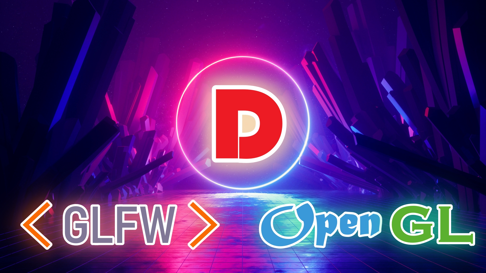

# D and GLFW/OpenGL project template
This is a project template for D and GLFW/OpenGL with DUB. It contains code for dynamically loading and initialization of GLFW and OpenGL libraries. 

Check out the [`dub.json`](dub.json) and [`source/libloader.d`](source/libloader.d) files for more info.



### Required toolchain
* [D](https://dlang.org/download) compiler
* [DUB](https://dub.pm/) package manager

### Dependencies
D uses the [bindbc-glfw](https://github.com/BindBC/bindbc-glfw) and [bindbc-opengl](https://github.com/BindBC/bindbc-opengl) packages. It is handled by DUB automatically. Please, make sure you have `GLFW` and `OpenGL` installed on your system. 

### Note for Windows users
You don't need to install GLFW. `glfw3.dll` comes with this repository. It may be found in the [`libs`](libs/) folder.

Modify your config file:
```
// dub.json
"dependencies": {
    "bindbc-glfw": "~>1.0.1",
    "bindbc-opengl": "~>1.0.3"
},
"versions": ["GLFW_33", "GL_33", "GL_AllowDeprecated"]
```
```
// dub.sdl
dependency "bindbc-glfw" version="~>1.0.1"
dependency "bindbc-opengl" version="~>1.0.3"
versions "GLFW_33" "GL_33" "GL_AllowDeprecated"
```

### Compiling and running
```
dub --build=release
```
`--build=release` is optional. Simply `dub` will compile and run the project automatically.

### LICENSE
All code is licensed under BSL software license.


